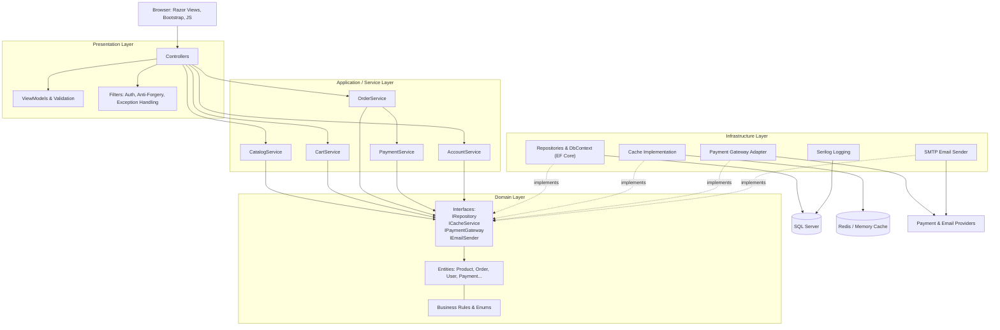

# E-Commerce Platform - Layered Architecture

```mermaid
flowchart TB
    Browser["Browser: Razor Views, Bootstrap, JS"]

    subgraph PRES["Presentation Layer"]
        Ctrl["Controllers"]
        VM["ViewModels & Validation"]
        Filters["Filters: Auth, Anti-Forgery, Exception Handling"]
    end

    subgraph APP["Application / Service Layer"]
        CatalogSvc["CatalogService"]
        CartSvc["CartService"]
        OrderSvc["OrderService"]
        PaySvc["PaymentService"]
        UserSvc["AccountService"]
    end

    subgraph DOM["Domain Layer"]
        Entities["Entities: Product, Order, User, Payment..."]
        Rules["Business Rules & Enums"]
        Contracts["Interfaces:<br/>IRepository<br/>ICacheService<br/>IPaymentGateway<br/>IEmailSender"]
    end

    subgraph INF["Infrastructure Layer"]
        Repo["Repositories & DbContext (EF Core)"]
        CacheImpl["Cache Implementation"]
        GatewayImpl["Payment Gateway Adapter"]
        MailImpl["SMTP Email Sender"]
        LogImpl["Serilog Logging"]
    end

    SQL[("SQL Server")]
    RedisC[("Redis / Memory Cache")]
    Ext["Payment & Email Providers"]

    Browser --> Ctrl

    Ctrl --> VM
    Ctrl --> Filters

    Ctrl --> CatalogSvc
    Ctrl --> CartSvc
    Ctrl --> OrderSvc
    Ctrl --> UserSvc

    OrderSvc --> PaySvc

    CatalogSvc --> Contracts
    CartSvc --> Contracts
    OrderSvc --> Contracts
    PaySvc --> Contracts
    UserSvc --> Contracts

    Contracts --> Entities
    Entities --- Rules

    Repo -.->|"implements"| Contracts
    CacheImpl -.->|"implements"| Contracts
    GatewayImpl -.->|"implements"| Contracts
    MailImpl -.->|"implements"| Contracts

    Repo --> SQL
    CacheImpl --> RedisC
    GatewayImpl --> Ext
    MailImpl --> Ext

    LogImpl --> SQL
```